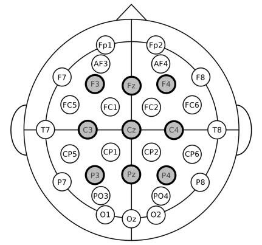

# Three.js EEG Brain Visualization Project

## Project Overview
This project is a Three.js-based visualization tool for displaying EEG (electroencephalography) brain data. It uses Three.js to create an interactive 3D representation of brain activity, with lighting and color changes representing real time EEG data points.

- **3D Brain Model Visualization**: Animates a detailed 3D brain model based on EEG data. EEG data is taken from the FACED dataset, with 10 30-second runs of the first subject looking at videos. 
- **Dynamic Lighting**: Lights positioned to correspond with EEG sensor positions, changing intensity based on EEG data.

    Electrode 2D sensor positions

## Interaction

- Use the slider at the top left to adjust the speed of display ( number of frames for interpolation)
- Once an example is finished running, press the "Next Example" button to play a random next file. The number of the example (/10) is displayed at the top left.

## File Structure
- `index.html` - Main HTML document with layout and references to CSS/JavaScript.
- `style.css` - Styles for the HTML elements.
- `script_subsurface.js` - Main JavaScript file containing Three.js code.

## Usage Notes
- **Data Source**: EEG data is loaded from a JSON file. Ensure proper format and accessibility.
- **Model Adjustments**: May require scale and position adjustments for different 3D models.
- **Browser Compatibility**: Designed for modern browsers supporting WebGL.
- **Future** : The goal is to create real time 3D visualization using the BitBrain/Muse 2 EEG headsets.

